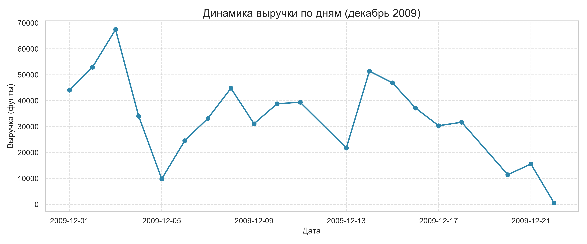

Исходный датасет: Online Retail II (~40 МБ, ~540 000 строк).
Датасет взят с сайта Kaggle.com.

Для размещения в репозитории сделан срез данных — это нужно, чтобы размер файла не превышал лимиты GitHub.
Срез содержит транзакции за период с 1 по 22 декабря 2009 года.
Размер файла .csv — 3,5 МБ.

Файл в репозитории: data/online_retail_II_sample.csv (имя выбрано специально, чтобы избежать путаницы с полным датасетом).

# E-commerce Analysis Case

**Роль:** системный аналитик данных (junior)  
**Задача:** проанализировать заказы интернет-магазина, найти точки роста и потерь, дать рекомендации бизнесу.  
**Источник данных:** [Online Retail dataset (Kaggle)](ссылка)  

## Что сделано

- Очистка данных: удалены отрицательные значения, пропуски, нормализованы типы.
- Расчёт метрик: AOV, доля возвратов, выручка по дням/категориям.
- Визуализация: динамика выручки, распределение чеков, доля возвратов.
- Рекомендации: конкретные шаги для бизнеса с ожидаемым эффектом.

## Ключевые метрики

| Метрика | Значение | Комментарий |
|---------|----------|-------------|
| AOV | X руб. | Средний чек |
| Доля возвратов | Y% | До очистки данных |
| Выручка (период) | Z руб. | Общая выручка за период |

## Инсайты и рекомендации

- **По дням:** можно сопоставить пики с маркетинговыми активностями и оценить их влияние на выручку.
- **AOV:** помогает сегментировать клиентов и подбирать предложения под разные ценовые сегменты.
- **Страны:** позволяет расставить приоритеты в работе с рынками: усиливать присутствие в топ‑странах и исследовать причины низкой выручки в остальных.


## Структура проекта

- `data/` — исходные данные (ссылка в README).
- `notebooks/` — Jupyter Notebook с пошаговым анализом.
- `reports/` — графики и визуализации.
- `src/` — скрипты (если есть).
- `requirements.txt` — зависимости.

## Как запустить

1. Клонируйте репозиторий.
2. Создайте виртуальное окружение и установите зависимости:
   ```bash
   python -m venv venv
   source venv/bin/activate  # Windows: venv\Scripts\activate
   pip install -r requirements.txt
